# Lab1 Sistemas Operativos
## Ejercicio 1

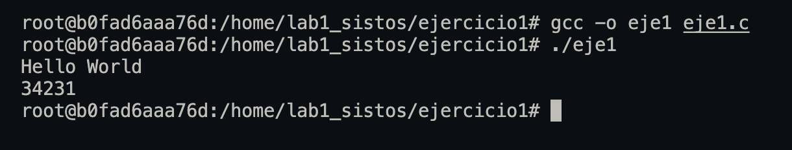

* Compile el primer programa y ejecútelo varias veces. Responda: ¿por qué aparecen números diferentes cada vez?  
  Porque se le asigna un número de proceso difernte al programa cada vez que se ejecuta.
  
* Proceda a compilar el segundo programa y ejecútelo una vez. ¿Por qué aparecen dos números distintos a pesar de que estamos ejecutando un único programa?  
  Porque uno es el proces id del proceso padre y otro es el proceso hijo
  
* ¿Por qué el primer y el segundo números son iguales?  
  Porque es el proceso padre, cuando verificamos si el valor de `f` es 0 realmente estamos verificando si es el proceso hijo.
  Por esta razón el proceso padre entra al `else` donde se ejecuta el primer programa e imprime el número de proceso,
  posteriormente el número del proceso se vuelve a imprimir.
  
* En la terminal, ejecute el comando top (que despliega el top de procesos en cuanto a consumo de CPU) y note cuál es el primer proceso en la lista (con identificador 1). ¿Para qué sirve este proceso?  
    
  Actualmente al estar ejecutando una maquina virtual en docker, mi process id 1 corresponde a `tail`, que sirve para que el contenedor no se detenga al momento de que el proceso de bash se detenga.
  Sin embargo, comunmente suele ser el `init` process que es el que inicia el kernel cuando se está booteando y sirve como predecesor de todos los demás procesos.
  Tiene un papel especial en el sistema y es responsable de inicializar el sistema y generar otros procesos.

## Ejercicio 2

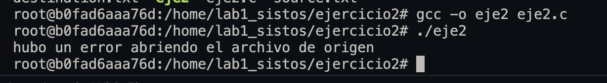

* Observe el resultado desplegado. ¿Por qué la primera llamada que aparece es `execve`?
  La llamada de sistema execve es la primera llamada en aparecer porque es la que inicia el proceso. La llamada execve carga el programa específico en el proceso actual.

* Ubique las llamadas de sistema realizadas por usted. ¿Qué significan los resultados (números que están luego del signo ‘=’)?
  Son los bytes que fueron escritos o leídos por la llamada.

* ¿Por qué entre las llamadas realizadas por usted hay un read vacío?
  
  No tengo ningún read vacío

* Identifique tres servicios distintos provistos por el sistema operativo en este strace. Liste y explique brevemente las llamadas a sistema que corresponden a los servicios identificados (puede incluir read, write, open o close que el sistema haga por usted, no los que usted haya producido directamente con su programa).

 __Ejecución__ __de__ __procesos:__  
``` bash
execve("./eje2", ["./eje2", "source.txt", "destination.txt"], 0x7fff477b2d90 /* 9 vars */) = 0
```
Esta llamada del sistema es responsable de ejecutar un programa. La ejecución de procesos es fundamental y es un servicio dado por el sistema operativo.

__Input__ __y__ __output__  
Cuando hacemos un print el sistema maneja el standard output para desplegar esa información. 
``` bash
write(1, "bytes escritos: 19\n", 19bytes escritos: 19
)    = 19
```

__Manejo__ __de__ __memoria__  
``` bash
mmap(NULL, 8192, PROT_READ|PROT_WRITE, MAP_PRIVATE|MAP_ANONYMOUS, -1, 0) = 0x7f991a8c4000
```
La llamada al sistema mmap se utiliza para asignar memoria en el adress space del proceso.

## Ejercicio 3
Para este ejercicio se usó un docker container para compilar el kernel. Primeramente, creamos un container privilegiado para tener más flexibilidad. Sin embargo, debemos tomar en cuenta que un container no puede ser *re-booteado* por lo que cuando compilemos la imagen del kernel se copiará a la maquina host para poder virtualizarlo usando qemu (Quick Emulator) para usar la imagen del kernel. Para hacer esto le vamos a pasar la imagen del kernel a qemu y un ramfs para hacer la llamada al sistema. El ramfs lo escribiremos en assembly. 


```bash
docker run --privileged -d --name sistos2 -it ubuntu tail -f /dev/null
```

Posteriormente ejecutamos bash y conectamos el standard output a nuestra terminal

```bash
docker exec -it sistos2 bash
```
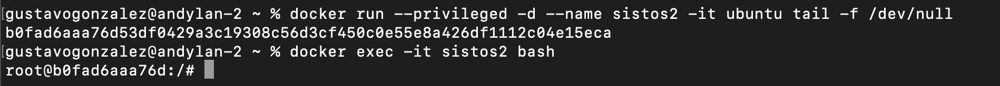

Después clonamos el kernel del repositorio en el container. La bandera depth nos sirve para indicar que no queremos copiar el historial de repositorios completos, en este caso estaremos trabajando con el ultimo commit.

```bash
git clone --depth 1 https://github.com/torvalds/linux.git
```

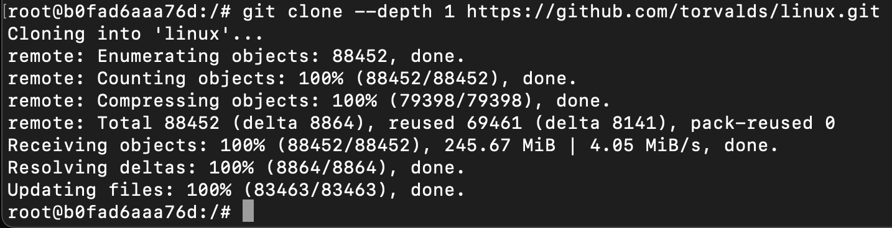


Posteriormente nos movemos a ese repositorio con `cd linux`. Dentro de este usamos vim para abrir `kernel/fork.c`, dentro de este vamos a usar el macro `SYSCALL_DEFINE0` para definir nuesta llamada al sistema

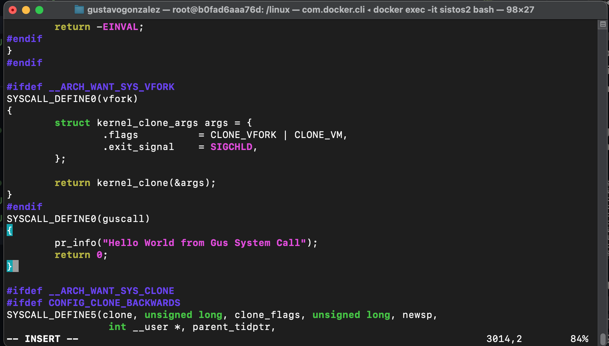

Posteriormente nos dirigimos a `include/linux/syscalls.h`; según la documentación del kernel de Linux, el entrypoint neceesita algo que ellos llaman un `function prototype` marcado como asmlinkage para que coincida con la forma en la que se invoca las llamadas al sistema.

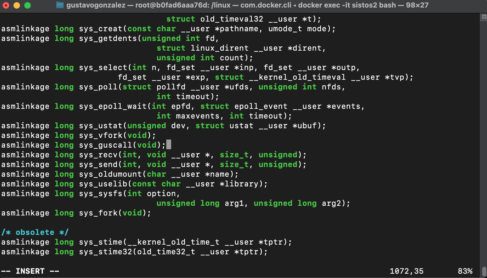

Ahora tenemos que agregar nuestra llamda al sistema al call table en `arch/x86/entry/syscalls/syscall_64.tbl`. Agregamos nuestra llamada al sistema con el número  `548`. 

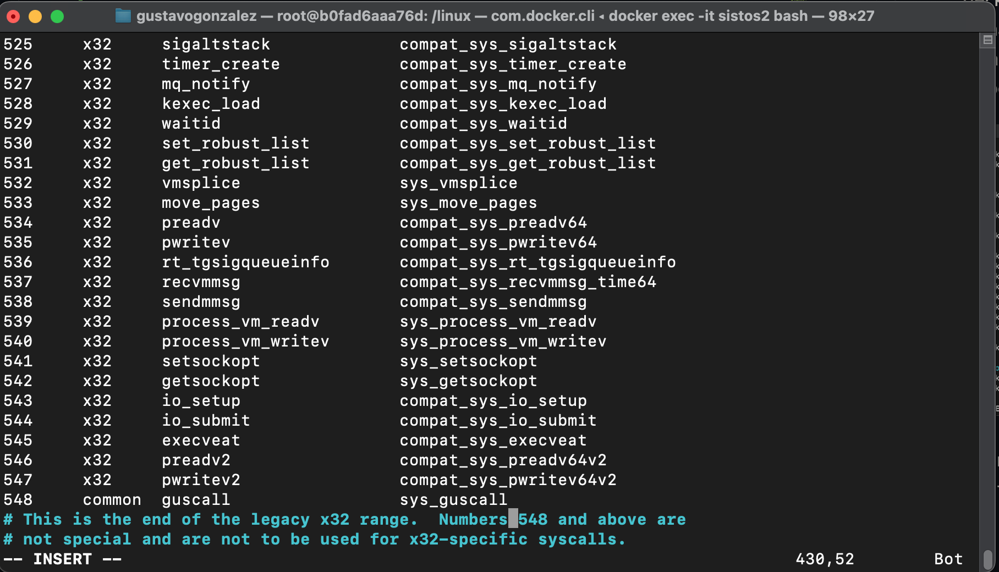


Una vez nuestra llamada este agregada al call table podemos compilar el kernel. Usaré `make -j 6` Para usar 6 de mis 8 cores y de esta forma acelerar el proceso de compilación.

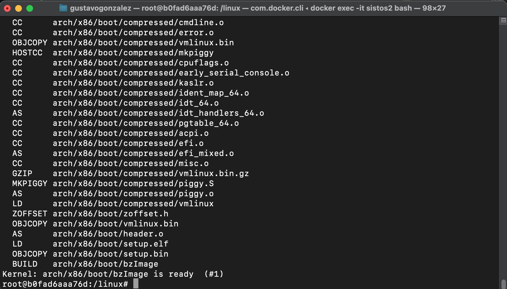

Ahora, en la consola host, copiaré la imagen del kernel al host 
```bash
docker cp b0fad6aaa76d:/linux/arch/x86/boot/bzImage .
```

Ahora, de regreso en nuestro container, vamos a crear nuestro archivo de assembly `init.asm` donde vamos a hacer la llamada al sistema. Al final vamos a poner un `jmp $` para dejarlo en un bucle infinito y podamos ver la llamada al sistema. 


```assembly
global _start

section .text

_start:
mov rax, 548
syscall

jmp $              
```

Para ensamblarlo vamos a usar nasm con formato felf64. Renombramos `a.out` a `init`

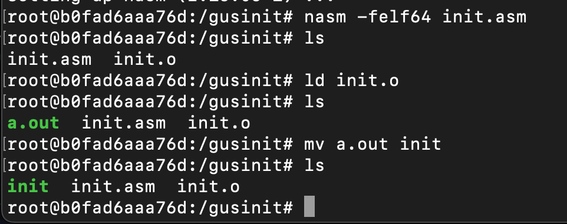


Creamos el ramfs y lo copiamos a nuestra maquina host:

En docker:
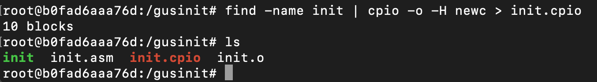

En host:
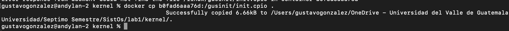

y ahora emulamos el booteo con Qemu
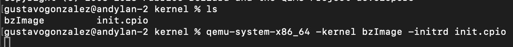

Resultado
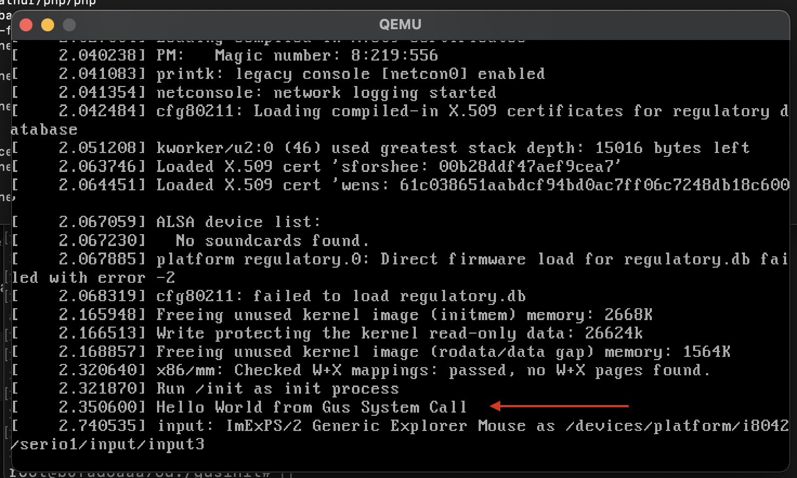

